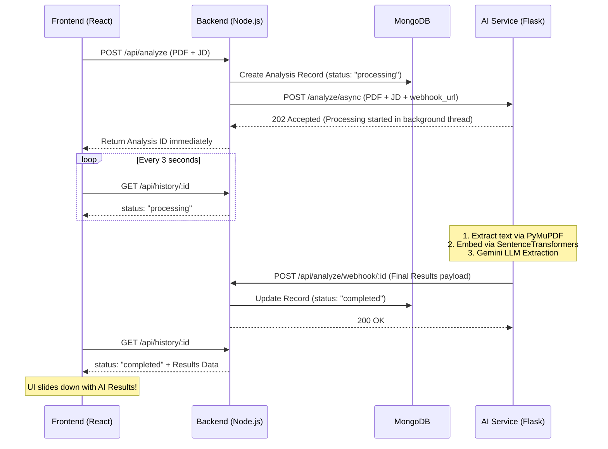

<div align="center">
  
  
  <br />
  <br />

  <h1>🧠 Smart Resume Analyzer & ATS Optimizer</h1>

  <p>
    <strong>A full-stack AI-powered web platform that evaluates resumes against job descriptions using Large Language Models (LLMs) and Vector Embeddings.</strong>
  </p>

  <p>
    <a href="#-ai-features"><strong>Explore Features</strong></a> ·
    <a href="#-setup-instructions"><strong>Installation Guide</strong></a> ·
    <a href="#-async-architecture"><strong>Architecture</strong></a>
  </p>

  <br />

  
  
  
  
  <br />
  
  
  
  
</div>

---

## ✨ AI Features

Unlike basic systems that rely on simple keyword regex matching, this application uses a state-of-the-art AI architecture:

- 🧮 **Semantic Similarity Scoring:** Uses `sentence-transformers/all-MiniLM-L6-v2` to compute the Cosine Similarity between the Resume and Job Description. It understands *context*, not just exact words.
- 🧠 **LLM Data Extraction:** Integrates with the **Google Gemini API** (`gemini-2.5-flash`) to intelligently read unstructured PDFs and extract formatted JSON data (Experience, Education, Projects).
- 🔍 **Dynamic Gap Analysis:** The LLM cross-references the job description with the resume to identify contextually missing skills and provide actionable ATS optimization tips.
- ⚡ **Asynchronous Background Processing:** Heavy AI tasks are offloaded to a non-blocking Python worker thread that communicates with the Node.js backend via Webhooks, keeping the frontend ultra-fast.

---

## 📸 Screenshots

*(Add your actual screenshots to the `docs/` folder and update these links!)*

| Dashboard Overview | AI Extracted Results |
|:---:|:---:|
|  |  |

---

## 📁 Project Structure

```text
smart-resume-analyzer/
├── backend/                  # Node.js + Express API
│   ├── controllers/          # Business & Webhook logic
│   ├── models/               # Mongoose schemas (User, Analysis)
│   ├── routes/               # Express routers (/api/analyze)
│   ├── .env                  # Environment variables
│   └── server.js             # Entry point
│
├── nlp-service/              # Python Flask AI service
│   ├── app.py                # Async LLM & Embedding worker
│   ├── .env                  # Gemini API Key configuration
│   └── requirements.txt      # PyTorch, SentenceTransformers, GenAI
│
└── frontend/                 # React + Vite + Tailwind UI
    └── src/
        ├── components/       # ResultsPanel, ScoreRing, etc.
        ├── pages/            # Dashboard view with automatic Polling
        └── utils/api.js      # Axios instance
```

---

## 🚀 Setup Instructions

### 1. NLP Service (AI Microservice)

You will need a free Gemini API Key from Google AI Studio.

```bash
cd nlp-service

# Create and activate a virtual environment
python -m venv venv
source venv/bin/activate       # macOS/Linux
# .\venv\Scripts\activate      # Windows

# Install AI dependencies (includes PyTorch, which may take a minute)
pip install -r requirements.txt
```

**Configure API Key:**
Open `nlp-service/.env` and add your key:
```env
FLASK_ENV=development
PORT=5001
GEMINI_API_KEY=YOUR_GEMINI_API_KEY_HERE
```

Start the service:
```bash
python app.py
```
*(Note: On initial boot, it will download the ~90MB embeddings model from Hugging Face).*

---

### 2. Backend Setup

```bash
cd backend
npm install
npm run dev
```
Runs on `http://localhost:5000`. Requires MongoDB to be running locally on port `27017`.

---

### 3. Frontend Setup

```bash
cd frontend
npm install
npm run dev
```
Runs on `http://localhost:5173`.

---

## 🔄 Async Architecture Flow

To prevent the web server from hanging while the AI processes heavy PDFs, this project utilizes a modern Webhook architecture:



---

## 🛠️ Common Issues

| Issue | Solution |
|-------|----------|
| `ModuleNotFoundError` during `python app.py` | Ensure your virtual environment is activated BEFORE running `pip install` and `python app.py`. |
| `AI Analysis service is offline` | The main Node server is trying to hit Python on port 5001, but it's not running. Start `python app.py`. |
| `LLM Extraction Failed` | You forgot to replace `YOUR_GEMINI_API_KEY_HERE` in `nlp-service/.env`. |
| `MongoServerError` | MongoDB is not running on your machine. Start the `mongod` service. |
